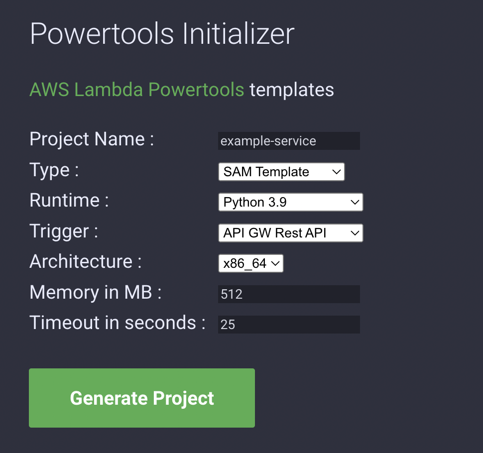

# Quick start for AWS Lambda

Create a mini [Spring initializer](https://start.spring.io/) for AWS Lambda functions.

## Backend service

- Builds a layer for the different cookiecutter templates. (NOTE: This will be limited for what we can bundle)
- Webservice includes a number of parameters for the aws lambda powertools templates:
  - `name`: defaults to `hello-world`, is the name of the project
  - `runtime`: defaults to python3.9, is the language runtime version (could also support typescript via nodejs)
  - `architecture`: defaults to `x86_64`, is the CPU architecture (can also be `arm64`)
  - `memory`: defaults 512, is the memory size of the lambda
  - `timeout`: defaults to 30, is the timeout of the lambda
  - `trigger`: defaults to `rest-api`, is the type of service calling the lambda function (could also support `s3`)
  - `type`: defaults to `sam`, is the IaC type (could also support `cdk`)
- Template repo name structure: `quickstart-<name>-<type>-<language>`

## UI

A minimal javascript UI using the webservice

## TODO

- [X] Initial prototype webservice
- [X] Create basic UI and deploy via GitHub pages
- [ ] Build out a better UI mock using figma
- [ ] Clean up and test coverage
- [ ] Add stricter cors policy
- [ ] Add contributing guide and build tools
- [ ] Add cookiecutter template for rest api (`quickstart-rest-api-sam-python`)
- [ ] Add cookiecutter template for http api (`quickstart-http-api-sam-python`)
- [ ] Add cookiecutter template for s3 api (`quickstart-s3-sam-python`)
- [ ] BONUS: Add cookiecutter template for rest api (`quickstart-rest-api-sam-typescript`)
- [ ] BONUS: Add cookiecutter template for http api (`quickstart-http-api-sam-typescript`)
- [ ] BONUS: Add cookiecutter template for s3 api (`quickstart-s3-sam-typescript`)
- [ ] BONUS: Add CDK templates
